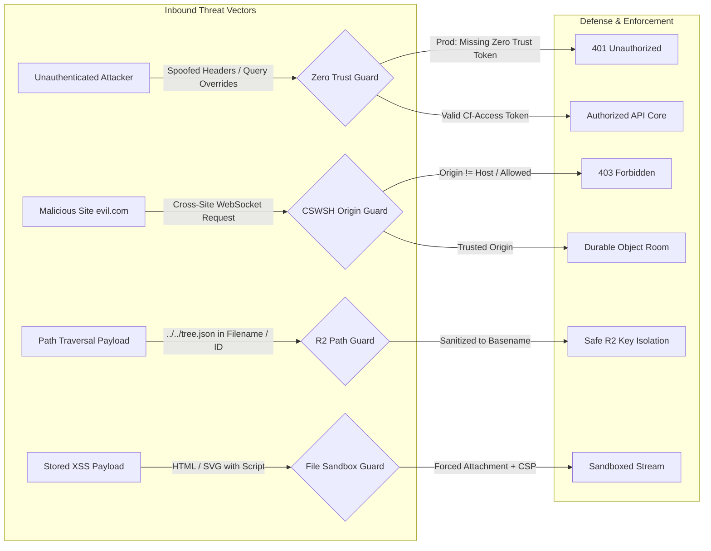
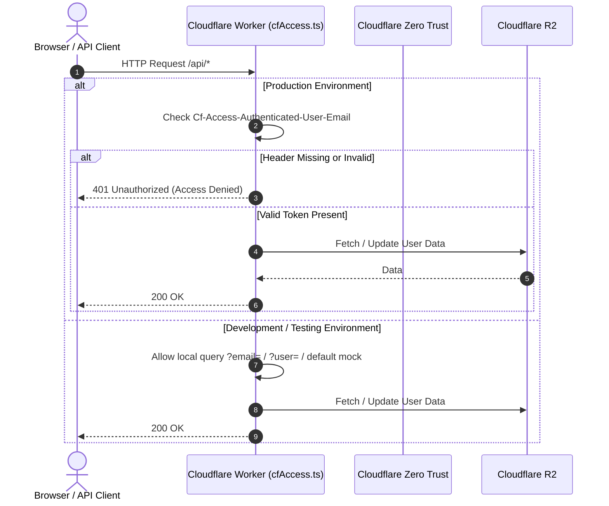
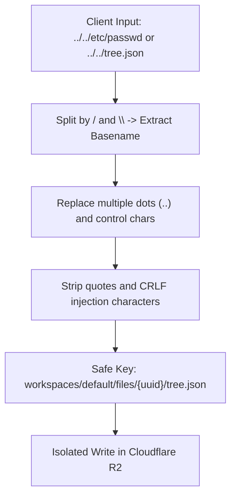
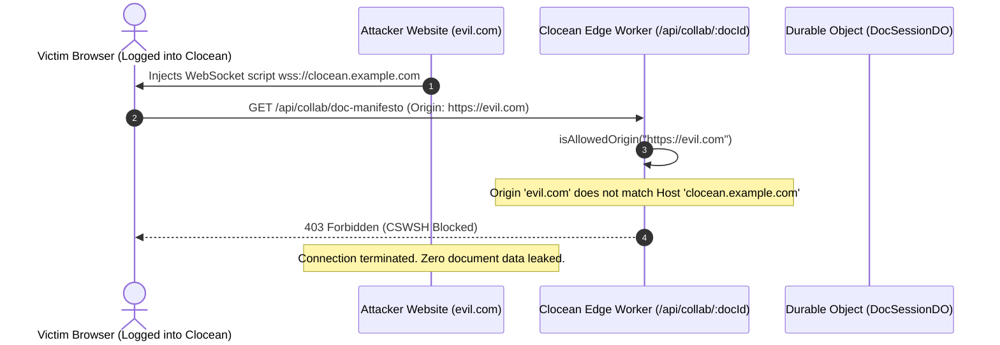

# Clocean System Architecture

This document provides an in-depth technical analysis of **Clocean's** architecture, explaining how collaborative document authoring, high-performance file management, and real-time edge synchronization are accomplished with **zero traditional database costs** using Cloudflare's serverless edge infrastructure.

---

## High-Level System Architecture


---

## Architectural Layers

### Layer 1: Edge Security & Authentication

Clocean uses Cloudflare Access as the production authentication boundary:

1. **Local Development OTP & Cryptographic Session Tokens**:
   * Local development can sign in or register with an email address.
   * The worker issues a secure, time-limited 6-digit numeric OTP code (`POST /api/auth/send-otp`). The hash is stored in R2 (`workspaces/registry/otp/{email}.json`) with a per-user salt to prevent replay and brute-force attacks (rate-limited, max 5 attempts, expires in 10 minutes).
   * Upon verification (`POST /api/auth/verify-otp`), the server signs an HMAC-SHA256 session token (`Authorization: Bearer <token>`) providing stateless, edge-verified sessions.
2. **Cloudflare Zero Trust / Access (Production)**:
   * Sits in front of the application domain (`clocean.yourcompany.com`).
   * Supports Google Workspace, GitHub, Microsoft 365, Okta, or Cloudflare Access OTP.
   * Passes authenticated identity headers down to the Worker:
     * `Cf-Access-Authenticated-User-Email`: Authenticated user's email address.
     * `Cf-Access-Jwt-Assertion`: Cryptographically signed JWT verified by the Worker against Cloudflare's JWKS, including issuer, audience, expiration, and signature checks.
   * Free for up to 50 active team members on Cloudflare's Zero Trust free tier.
   * Production email OTP signup is disabled. The Worker rejects requests without a verified Access JWT.

---

### Layer 2: Frontend Single Page Application (Cloudflare Pages)
* **Framework**: React 19 + TypeScript + Vite.
* **Serving**: Built into `./dist` and served via Cloudflare Workers Static Assets (`env.ASSETS`).
* **Design Tokens**: Pure CSS variables inspired by the Figma design system:
  * **Typography**: `Spectral` (Serif) for headings and brand logo; `Schibsted Grotesk` (Sans-serif) for UI components.
  * **Theme**: Warm Parchment (`#FAF8F5`) for an editorial, distraction-free writing surface.
  * **Icons**: Curated Lucide icons matching the Figma artboard specs.

---

### Layer 3: Edge API & Real-Time Collaboration

#### 1. REST API (`worker/index.ts`)
Powered by [Hono](https://hono.dev/), a lightweight, edge-optimized routing framework with sub-millisecond route matching.
* `GET /api/me`: Returns user profile, active workspaces, and authentication status.
* `POST /api/auth/send-otp`: Dispatches a 6-digit verification code for login, setup, or workspace joining.
* `POST /api/auth/verify-otp`: Validates the OTP code, issues session token, and provisions profile.
* `GET /api/workspaces/:wsId/invite-info`: Unauthenticated endpoint returning public workspace name, icon, and member count for Notion-style share links.
* `POST /api/workspaces/:wsId/join`: Authenticated endpoint that completes a previously issued invitation; knowing a workspace ID alone is insufficient.
* `GET /api/workspaces/:wsId/members`: Lists the authenticated workspace roster.
* `DELETE /api/workspaces/:wsId/members/:email`: Removes a member for an owner or admin; owners and the current user cannot be removed.
* `GET /api/tree`: Returns workspace folder and document tree.
* `POST /api/tree/node`: Creates a note or folder with an optional parent folder.
* `PUT /api/tree/node/:id`: Renames or moves a note or folder.
  * Moves validate that the destination is a folder and reject self or descendant cycles.
* `POST /api/upload`: Direct streaming multipart upload to R2 without buffering in RAM.
* `GET /api/files/:id/:filename`: Streams authenticated binary files from R2 with byte-range requests for documents and media.
* `POST /api/user/avatar`: Uploads and validates custom profile avatar pictures directly to R2.
* `GET /api/user/avatar/:email`: Edge-cached streaming of user avatar images with Dicebear fallback.
* `GET /api/task-boards`, `POST /api/task-boards`: Lists and creates independent task boards.
* `GET /api/tasks?boardId=:id`, `PUT /api/tasks?boardId=:id`: Persists each board's Kanban tasks with calendar due dates.
* `POST /api/tasks/check-deadlines`: Scans tasks for deadlines due within 48 hours and sends email alerts.
* `GET /api/photos`: Legacy media metadata retained for existing R2 records; media is presented from Documents in the main UI.

#### 2. Durable Objects Real-Time Room Sync (`worker/durable_objects/DocSessionDO.ts`)
* When multiple users open a document, their browsers establish a WebSocket connection to:
  ```text
  wss://clocean.yourdomain.com/api/collab/:docId
  ```
* Cloudflare routes the WebSocket to a unique **Durable Object instance** identified by `docId`.
* **State Management**:
  * The Durable Object maintains active WebSocket connections in memory.
  * When a user types, an `edit` message containing the delta is broadcasted to all other connected peers.
  * When a user moves their cursor, a `cursor` message broadcasts their live cursor position and color-coded name tag.
* **WebSocket Hibernation API**:
  * Dormant WebSockets consume zero CPU cycles. The Durable Object unloads from memory while keeping the TCP/TLS connection open at the Cloudflare edge.
* **Debounced Persistence to R2**:
  * As edits arrive in memory, the Durable Object marks its state as dirty and debounces flushes (every 2.5 seconds or on last collaborator disconnect), saving the updated document JSON to `workspaces/default/docs/{docId}/content.json`.

---

### Layer 4: Cloudflare R2 as a JSON Database

#### Why R2 Replaces Traditional Databases
Traditional databases (e.g. AWS RDS PostgreSQL, Atlas MongoDB) incur substantial monthly baseline costs ($20–$100+/mo) and bandwidth egress fees.

Cloudflare R2 provides:
1. **$0.00 Egress Fees**: Download unlimited gigabytes of files with zero bandwidth charges.
2. **Generous Free Operations**: 10,000,000 Class B reads, 1,000,000 Class A writes, and 10 GB storage per month.
3. **Strong Read-After-Write Consistency**: Once a JSON model is written, all subsequent edge reads immediately reflect the new data.

#### Key Schema Structure
```text
workspaces/registry/
├── users/
│   └── {email}.json                   # User's registered organizations & assigned roles
└── otp/
    └── {email}.json                   # Hashed 6-digit verification code, salt, attempts, metadata

workspaces/{workspaceId}/              # Multi-tenant partitioned team root (e.g. 'default', 'ws-design')
├── meta.json                          # Organization metadata (name, icon, owner, timestamps)
├── members.json                       # Team roster (emails, display names, avatars, roles: owner/admin/member)
├── tree.json                          # File & folder hierarchy isolated to this organization
├── tasks.json                         # Default Kanban board tasks
├── task-boards.json                   # Task board registry
├── task-boards/{boardId}.json         # Tasks for additional boards
├── photos.json                        # Photos gallery index isolated to this organization
├── activity.json                      # Organization-specific activity changelog
├── favorites.json                     # Pinned and starred documents per user
├── public/
│   └── {token}.json                   # Read-only public share mappings
├── users/
│   └── {email}.json                   # User profile, display name, preferences
├── avatars/
│   └── {email}.png                    # Uploaded user profile picture (binary)
├── docs/
│   └── {docId}/
│       ├── content.json               # Document blocks, text, checklists, attachments
│       ├── revisions.json             # Document version history snapshots
│       └── comments.json              # Discussion comments and @mentions
└── files/
    └── {fileId}/
        └── {filename}                 # Raw binary uploads (PDF, ZIP, images, docs)
```

#### Optimistic Concurrency Control (ETags)
To prevent race conditions when two users rename or move files in the tree simultaneously, `r2Db.ts` uses R2's native **HTTP ETags**. A failed conditional write returns a conflict and is never retried unconditionally:
```typescript
await bucket.put(key, jsonString, {
  onlyIf: { etagMatches: expectedEtag }
});
```
If another process updated `tree.json` in the meantime, the write fails safely rather than overwriting changes.

---

### Layer 5: Multi-Tenant Organizations & Team Workspaces

Clocean supports multi-tenant team organizations with zero database overhead. Users can belong to multiple workspaces, switch seamlessly between them, create new team workspaces, and invite teammates with role-based access.

```mermaid
graph TD
    Client([Collaborator Client]) -->|x-workspace-id: ws-design-alpha| Edge[Hono Edge Router]

    subgraph Multi-Tenant R2 Storage
        Edge -->|Roster & Role Checks| MembersDoc[(workspaces/{wsId}/members.json)]
        Edge -->|Organization 1 Data| OrgA[(workspaces/ws-design-alpha/...)]
        Edge -->|Default Organization Data| OrgDefault[(workspaces/default/...)]
        Edge -->|User Workspace Directory| UserRegistry[(workspaces/registry/users/{email}.json)]
    end

    subgraph Real-Time Multi-Tenant Isolation
        Client -->|wss://.../api/collab/:docId?ws=ws-design-alpha| DO_A[Durable Object Room<br/>ws-design-alpha:doc-1]
        OtherPeer([Peer in Default Team]) -->|wss://.../api/collab/:docId?ws=default| DO_Default[Durable Object Room<br/>default:doc-1]
    end
```

#### Multi-Tenancy Principles
1. **Zero Database Multi-Tenancy**: All workspace partitions live as key prefixes in the R2 bucket (`workspaces/{workspaceId}/...`). Creating a team requires zero migration scripts, zero table alterations, and zero additional cloud costs.
2. **Strict Cryptographic Isolation**: Document IDs are identical across teams without conflict because every request is partitioned by `workspaceId`. A document in Team A is inaccessible to Team B.
3. **Isolated Real-Time Durable Object Rooms**: Collab room IDs are scoped as `${workspaceId}:${docId}`. WebSocket broadcasts and in-memory operational transforms never cross organization boundaries.
4. **Role-Based Access Control**:
   - **`owner`**: Created the workspace; can manage team members, invite new colleagues, and delete content.
   - **`admin`**: Can invite new teammates and manage workspace settings.
   - **`member`**: Can view, edit, upload, and collaborate in real time.
---

### Layer 6: @ Mentions & Email Notification System

Clocean features an edge-native **@ mention and transactional email notification engine**. When a collaborator mentions a teammate using `@Name` or `@email` in any block document or document discussion thread, the system automatically detects the mention, formats an Obsidian/Parchment branded HTML email, dispatches the notification, and synchronizes the recipient's in-app notification center.

```mermaid
graph TD
    Author([Collaborator]) -->|Types '@Elena Rostova' in Doc or Comment| Editor[EditorView.tsx]
    Editor -->|PUT /api/docs/:id or POST /api/docs/:id/comments| EdgeAPI[Worker Edge API]

    subgraph Mention Processing & Notification Engine
        EdgeAPI -->|Extract Mentions| Notifier[emailNotifier.ts]
        Notifier -->|Lookup Recipient & Sender| Roster[(workspaces/{wsId}/members.json)]
        Notifier -->|Generate Branded HTML Email| EmailRenderer[Obsidian-styled Email Template]
        EmailRenderer -->|Cloudflare Email Routing / Transactional API| Mailbox([Recipient Email Inbox])
        Notifier -->|Persist Notification Item| UserInbox[(users/{recipientEmail}/notifications.json)]
        Notifier -->|Audit Log| Outbox[(workspaces/{wsId}/notifications/outbox.json)]
    end

    Recipient([Mentioned Teammate]) -->|Header Notification Bell| AppShell[Header.tsx]
    Recipient -->|Direct Email Deep Link| Browser[Opens Clocean Document]
```

#### How It Works
1. **Interactive Autocomplete**: Typing `@` in the editor or comments panel displays a teammate popup with member avatars, names, emails, and roles.
2. **Edge Regex & Fuzzy Detection**: `extractMentions` scans text for direct email mentions (`@elena@clocean.co`), full names (`@Elena Rostova`), and first names (`@Elena`), while preventing self-notification.
3. **Figma-Branded HTML Emails**: Generates a responsive dark Obsidian/Warm Parchment HTML email with Clocean branding, sender avatar, context quote snippet, and direct deep-link (`/?doc={id}&ws={wsId}`).
4. **Zero-Database Notification Inboxes**: Notifications are stored directly in Cloudflare R2 at `workspaces/registry/users/{email}/notifications.json` with an outbox audit log at `workspaces/{wsId}/notifications/outbox.json`.
5. **Real-Time Notification Bell**: The app header features an interactive notification bell with unread count badges and one-click mark-as-read.

---

### Layer 7: Notion-Style Workspace & Document Sharing Flow

Clocean enables frictionless team onboarding and document sharing inspired by Notion's link-sharing model, operating without an external relational database.

```mermaid
graph TD
    ShareLink["Share Link: ?join={wsId}&doc={docId}"] --> VisitorCheck{"Is Visitor Logged In?"}
    VisitorCheck -->|Yes (Has Valid Session)| OneClickJoin["Prompt 1-Click Join<br/>POST /api/workspaces/:wsId/join"]
    VisitorCheck -->|No (First-Time Visitor)| FetchPublicInfo["Fetch Public Workspace Info<br/>GET /api/workspaces/:wsId/invite-info"]
    FetchPublicInfo --> Banner["Render Team Welcome Banner<br/>'Join Acme • Invited by Alice'"]
    Banner --> RequestOtp["Enter Email -> Send 6-Digit OTP<br/>POST /api/auth/send-otp"]
    RequestOtp --> VerifyOtp["Verify OTP -> Auto-Add to Roster<br/>POST /api/auth/verify-otp"]
    VerifyOtp --> EnterDoc["Redirect Directly to Shared Document"]
    OneClickJoin --> EnterDoc
```

1. **Deep-Linked Share URLs**:
   - Workspace Invite: `https://clocean.example.com/?join=ws-marketing`
   - Document Invite: `https://clocean.example.com/?join=ws-marketing&doc=doc-q4-strategy`
2. **Public Invite Metadata Endpoint (`GET /api/workspaces/:wsId/invite-info`)**:
   - Unauthenticated visitors fetch public workspace name, icon, member count, and owner name without exposing internal documents, trees, or membership emails.
3. **New User Onboarding via Email OTP**:
   - The user inputs their email address and receives a 6-digit numeric OTP.
   - Verifying the code creates their user profile and automatically calls `addWorkspaceMember`, granting instant access and redirecting to the target document.
4. **1-Click Join for Existing Users**:
   - Teammates already authenticated receive a non-intrusive prompt: *"You've been invited to join Acme. [Join Workspace]"*.
   - A single click registers them in the workspace roster and activates the workspace in their organization switcher.

---

### Layer 8: Task Deadlines & Edge Email Alert Engine

To keep teams synchronized on delivery dates, Clocean integrates calendar-based task deadlines with automated edge alerting.

1. **Calendar Due Dates**: Tasks record standardized ISO calendar strings (`YYYY-MM-DD`), rendered with status indicators (`Today`, `Overdue`, `In 2 days`).
2. **Deadline Scanner Routine (`POST /api/tasks/check-deadlines`)**:
   - Can be triggered manually or via a Cloudflare Workers Cron Trigger (`[triggers.crons]`).
   - Scans `tasks.json` in R2 and calculates the delta between current edge timestamp and task due dates.
   - For any incomplete task due within 48 hours (or overdue) that has not yet been alerted, the engine:
     - Formats an alert email to the task assignee.
     - Appends an entry to the user's notifications inbox (`workspaces/registry/users/{email}/notifications.json`).
     - Updates `lastAlertedAt` on the task item to prevent duplicate emails.

---

## Security Architecture & Threat Defenses

Clocean implements an enterprise-grade defense-in-depth model engineered specifically for the serverless edge, preventing user impersonation, data leaks, path traversal attacks, and cross-site hijacking.



---

### 1. Zero Trust Edge Authentication & Environment Gating
* **Threat Addressed**: Unauthorized access, account impersonation via spoofed headers or dev parameters.
* **Defense Mechanism**:
  * In **Production** (`ENVIRONMENT = "production"`), dev query parameters (`?email=`, `?user=`) and custom testing headers (`x-user-email`) are unconditionally stripped.
  * Requests must originate through Cloudflare Zero Trust with a valid `Cf-Access-Jwt-Assertion`. The Worker verifies the JWT signature against the configured JWKS, issuer, audience, and time claims before using the email claim.
  * Unauthenticated requests in production receive an immediate `401 Unauthorized` without querying R2.
  * In **Local Development / Open Source Testing** (`ENVIRONMENT != "production"`), local mock fallbacks are automatically enabled so open-source contributors can run and test multiplayer features with zero initial Cloudflare Access configuration. Production deployments fail closed when Access configuration is missing.



---

### 2. R2 Path Traversal & Internal Database Isolation
* **Threat Addressed**: Key manipulation via directory traversal (`../../tree.json`), overwriting root database indices.
* **Defense Mechanism**:
  * All file names are passed through `sanitizeFilename()` before forming R2 keys:
    * Traversal prefixes (`/`, `\`, `..`) are stripped down to the safe base filename.
    * Illegal filesystem and URI characters (`\x00-\x1f`, `<`, `>`, `:`, `"`, `|`, `?`, `*`) are sanitized to `_`.
    * Quotes and newline characters (`\r`, `\n`) are removed to prevent HTTP response header injection.
  * All URL parameters (`:id`, `:docId`) are validated against `^[a-zA-Z0-9_\-\.]+$` to guarantee they cannot escape their designated key namespace.



---

### 3. Cross-Site WebSocket Hijacking (CSWSH) Defense
* **Threat Addressed**: Malicious third-party websites connecting to `wss://clocean.yourdomain.com/api/collab/:docId` using the victim's ambient browser cookies to read or tamper with live documents.
* **Defense Mechanism**:
  * During the WebSocket upgrade handshake on `/api/collab/:docId`, `isAllowedOrigin()` verifies the incoming `Origin` header against the request `Host` and any configured `ALLOWED_ORIGINS`.
  * Untrusted cross-site origins are rejected with `403 Forbidden` before establishing a Durable Object session.



---

### 4. Stored XSS Prevention & File Streaming Sandbox
* **Threat Addressed**: Uploading malicious HTML, SVG, or scripts that execute within the application's domain context.
* **Defense Mechanism**:
  * Streamed file endpoints attach defense-in-depth security headers:
    * `Content-Security-Policy: sandbox; default-src 'none';`: Strips scripting capabilities from rendered files.
    * `X-Content-Type-Options: nosniff`: Prevents MIME-confusion attacks.
    * `X-Frame-Options: SAMEORIGIN`: Prevents clickjacking.
  * **Safe Format Gating**: Only safe non-executable image formats (`.png`, `.jpg`, `.jpeg`, `.webp`, `.gif`) and `.pdf` may be served with `Content-Disposition: inline`. All active or executable formats (HTML, SVG, XML, JS, etc.) are forced to `Content-Disposition: attachment`, preventing arbitrary script execution.
  * File previews fetch through the authenticated API with the current session token, render from temporary blob URLs, and revoke those URLs when the modal closes. PDF and text previews use sandboxed iframes; unsafe formats remain downloads.

```mermaid
graph TD
    FileReq["GET /api/files/:id/:filename"] --> ExtCheck{"Is extension safe image or PDF?"}
    ExtCheck -->|Yes (.png, .jpg, .pdf)| Inline["Content-Disposition: inline"]
    ExtCheck -->|No (.html, .svg, .xml, .exe)| Attach["Content-Disposition: attachment (Forced Download)"]
    Inline --> AddHeaders["Attach Security Headers:<br/>nosniff<br/>CSP: sandbox<br/>X-Frame-Options: SAMEORIGIN"]
    Attach --> AddHeaders
    AddHeaders --> Response["Secure Sandboxed Response Stream"]
```

---

## Performance Characteristics
* **Edge Proximity**: Cloudflare Workers run across 330+ cities worldwide within ~50ms of 95% of the world's population.
* **Cold Starts**: Cloudflare V8 isolates start in **< 5ms**, eliminating the multi-second cold start delays common in Docker / Lambda architectures.
* **Direct File Streaming**: Uploads and downloads stream directly through the Worker into R2 via standard web streams without buffering in memory.
