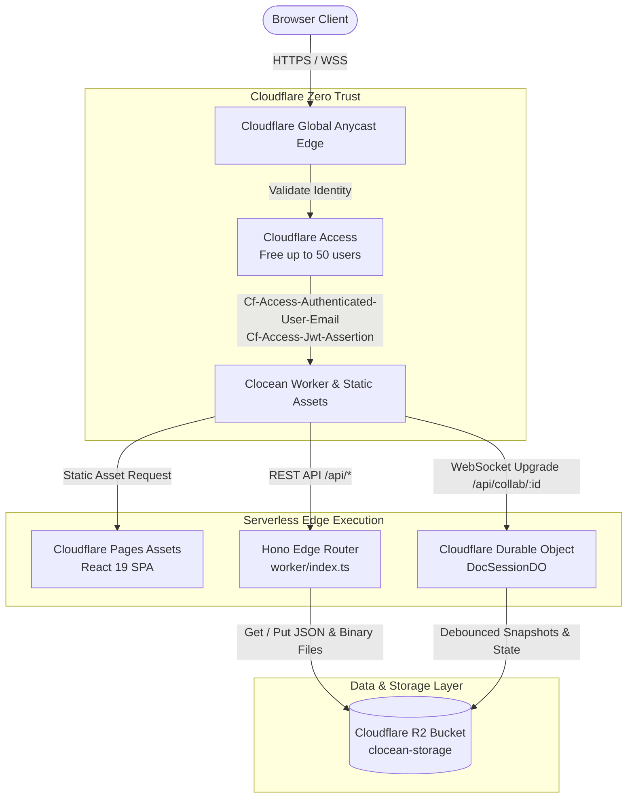

# Clocean System Architecture

This document provides an in-depth technical analysis of **Clocean's** architecture, explaining how Notion-style collaborative document editing and Google Drive-style file management are accomplished with **zero traditional database costs** using Cloudflare's serverless edge infrastructure.

---

## 🏛️ High-Level System Architecture



---

## 🧩 Architectural Layers

### Layer 1: Edge Security & Authentication (Cloudflare Zero Trust)
* **Goal**: Authenticate users without building custom authentication tables, hashing passwords, or running OAuth servers.
* **Mechanism**:
  * Cloudflare Access sits in front of the application domain (`clocean.yourdomain.com`).
  * Supports Google Workspace, GitHub, Microsoft 365, or Email One-Time PIN (OTP).
  * Requests that pass Cloudflare Access are decorated with cryptographic headers:
    * `Cf-Access-Authenticated-User-Email`: Authenticated user's email address.
    * `Cf-Access-Jwt-Assertion`: Cryptographically signed JWT token verified by the Worker against Cloudflare's public certs.
* **Cost**: Free for up to 50 team members on the Cloudflare Zero Trust free tier.

---

### Layer 2: Frontend Single Page Application (Cloudflare Pages)
* **Framework**: React 19 + TypeScript + Vite.
* **Serving**: Built into `./dist` and served via Cloudflare Workers Static Assets (`env.ASSETS`).
* **Design Tokens**: Pure CSS variables inspired by the Figma design system:
  * **Typography**: `Spectral` (Serif) for headings and brand logo; `Schibsted Grotesk` (Sans-serif) for UI components.
  * **Themes**: Warm Parchment (`#FAF8F5`) for light mode, Obsidian (`#1C1C1A`) for dark mode.
  * **Icons**: Curated Lucide icons matching the Figma artboard specs.

---

### Layer 3: Edge API & Real-Time Multiplayer Collaboration

#### 1. REST API (`worker/index.ts`)
Powered by [Hono](https://hono.dev/), a lightweight, edge-optimized routing framework with sub-millisecond route matching.
* `GET /api/me`: Returns user profile and avatar.
* `GET /api/tree`: Returns workspace folder and document tree.
* `POST /api/upload`: Direct streaming multipart upload to R2 without buffering in RAM.
* `GET /api/files/:id/:filename`: Streams binary files from R2 with byte-range requests for audio/video/PDFs.
* `GET /api/tasks`, `PUT /api/tasks`: Kanban board persistence.
* `GET /api/photos`: Media gallery metadata.

#### 2. Durable Objects Real-Time Room Sync (`worker/durable_objects/DocSessionDO.ts`)
* When multiple users open a document, their browsers establish a WebSocket connection to:
  ```text
  wss://clocean.yourdomain.com/api/collab/:docId
  ```
* Cloudflare routes the WebSocket to a unique **Durable Object instance** identified by `docId`.
* **State Management**:
  * The Durable Object maintains active WebSocket connections in memory.
  * When a user types, an `edit` message containing the delta is broadcasted to all other connected peers.
  * When a user moves their cursor, a `cursor` message broadcasts their live cursor position and color-coded name tag.
* **WebSocket Hibernation API**:
  * Dormant WebSockets consume zero CPU cycles. The Durable Object unloads from memory while keeping the TCP/TLS connection open at the Cloudflare edge.
* **Debounced Persistence to R2**:
  * As edits arrive in memory, the Durable Object marks its state as dirty and debounces flushes (every 2.5 seconds or on last collaborator disconnect), saving the updated document JSON to `workspaces/default/docs/{docId}/content.json`.

---

### Layer 4: Cloudflare R2 as a JSON Database

#### Why R2 Replaces Traditional Databases
Traditional databases (e.g. AWS RDS PostgreSQL, Atlas MongoDB) incur substantial monthly baseline costs ($20–$100+/mo) and bandwidth egress fees.

Cloudflare R2 provides:
1. **$0.00 Egress Fees**: Download unlimited gigabytes of files with zero bandwidth charges.
2. **Generous Free Operations**: 10,000,000 Class B reads, 1,000,000 Class A writes, and 10 GB storage per month.
3. **Strong Read-After-Write Consistency**: Once a JSON model is written, all subsequent edge reads immediately reflect the new data.

#### Key Schema Structure
```text
workspaces/default/
├── tree.json                          # Full file & folder hierarchy
├── tasks.json                         # Kanban sprint tasks
├── photos.json                        # Photos gallery index
├── activity.json                      # Workspace changelog
├── users/
│   └── {email}.json                   # User profile, display name, preferences
├── avatars/
│   └── {email}.png                    # Uploaded user profile picture
├── docs/
│   └── {docId}/
│       └── content.json               # Document blocks, text, checklists, attachments
└── files/
    └── {fileId}/
        └── {filename}                 # Raw binary uploads (PDF, ZIP, images, docs)
```

#### Optimistic Concurrency Control (ETags)
To prevent race conditions when two users rename or move files in the tree simultaneously, `r2Db.ts` uses R2's native **HTTP ETags**:
```typescript
await bucket.put(key, jsonString, {
  onlyIf: { etagMatches: expectedEtag }
});
```
If another process updated `tree.json` in the meantime, the write fails safely rather than overwriting changes.

---

## ⚡ Performance Characteristics
* **Edge Proximity**: Cloudflare Workers run across 330+ cities worldwide within ~50ms of 95% of the world's population.
* **Cold Starts**: Cloudflare V8 isolates start in **< 5ms**, eliminating the multi-second cold start delays common in Docker / Lambda architectures.
* **Direct File Streaming**: Uploads and downloads stream directly through the Worker into R2 via standard web streams without buffering in memory.
